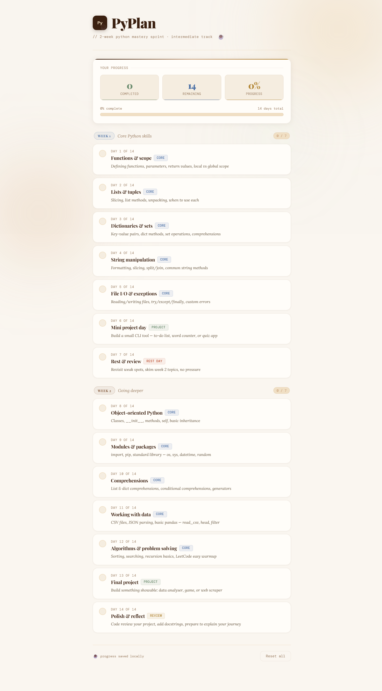

# ☕ PyPlan — 2-Week Python Sprint

A focused, distraction-free study tracker to help you go from beginner to confident Python developer in 14 days. Tap a day to mark it done, watch your progress brew, and stay consistent.

## 📸 Preview

## ✨ Features

- 14-day structured Python learning plan — curated topics, right order
- One-tap day completion with satisfying progress tracking
- Warm coffee-vibe light mode UI — easy on the eyes during long study sessions
- Works fully offline as a **Progressive Web App (PWA)**
- Install directly from your browser — no App Store needed
- Progress saved locally in your browser (persists across sessions)
- Fully responsive — works great on mobile and desktop

## 📱 Install as a Mobile App (PWA)

No app store. No sign-up. Just open and install.

**Android (Chrome):**
1. Open the live URL in Chrome
2. Tap ⋮ menu → **"Add to Home Screen"**
3. Tap **Install**

**iPhone (Safari):**
1. Open the live URL in Safari
2. Tap the **Share** button (box with arrow)
3. Tap **"Add to Home Screen"** → **Add**

## 🗓️ The 14-Day Plan

| Day | Topic | Type |
|-----|-------|------|
| 1 | Functions & scope | Core |
| 2 | Lists & tuples | Core |
| 3 | Dictionaries & sets | Core |
| 4 | String manipulation | Core |
| 5 | File I/O & exceptions | Core |
| 6 | Mini project day | Project |
| 7 | Rest & review | Rest |
| 8 | Object-oriented Python | Core |
| 9 | Modules & packages | Core |
| 10 | Comprehensions | Core |
| 11 | Working with data | Core |
| 12 | Algorithms & problem solving | Core |
| 13 | Final project | Project |
| 14 | Polish & reflect | Review |

## 🚀 Live Demo

> 🔗 [aamina-shaik.github.io/pyplan](https://aamina-shaik.github.io/pyplan)

## 🛠️ Tech Stack

- Pure **HTML, CSS, JavaScript** — zero dependencies, zero frameworks
- **PWA** with Service Worker for offline support
- **localStorage** for persistent progress
- Fonts: Playfair Display · Lora · DM Mono via Google Fonts

## 📄 License

MIT — free to use, fork, and share.

---

*Built with ☕ and Python love.*
